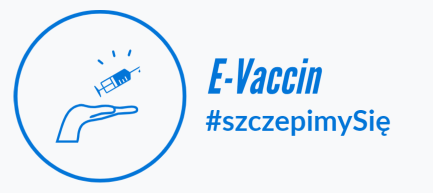

# e-Vaccin
## Aplikacja e-Vaccin jest narzędziem przeznaczonym do rezerwacji terminów szczepień przeciwko Covid-19. Odbiorcami aplikacji są pacjenci chcący umówić się na wizytę w celu zaszczepienia oraz pracownicy placówek medycznych, którzy zarządzają kalendarzem szczepień w danym podmiocie medycznym.

# Aplikacja powstała jako grupowy projekt zaliczeniowy studia podyplomowe, a autorami są: Yulia Morina, Justyna Zahraj oraz Marcin Ciosek

---

## SPIS TREŚCI
* [INSTALACJA I URUCHOMIENIE APLIKACJI](#instalation)
* [REJESTRACJA NOWEGO UŻYTKOWNIKA](#register)
* [LOGOWANIE](#loging)
* [PANEL PACJENTA](#user_panel)
* [PANEL PRACOWNIKA](#employee_panel)

<a name="instalation">

### INSTALACJA I URUCHOMIENIE APLIKACJI
W celu uruchomienia aplikacji należy:
* wgrać pliki z kodem źródłowym na własny hosting z przypisaną do niego domeną.
* utworzyć nową bazę danych, a następnie poprzez panel phpMyAdmin wczytać bazę danych będącą jednym z elementów plikow źródłowych.
* w plikach źródłowych (dbconnect.php oraz location.php) umieszczonych na własnym hostingu należy uzupełnić/zmienić dane dotyczące utworzonej bazy danych: nazwa użytkownika, hasło do bazy danych, nazwę bazy danych, lokalizację - nazwa domeny, adres mailowy do wysyłki maili.
* po uruchomieniu aplikacji w przeglądarce każdy użytkownik (pracownik przychodni) loguje się na własne dane dostępowe.
* nowi użytkownicy (pacjenci) zakładają swoje konta poprzez panel rejestracji nowego użytkownika.

<a name="loging">

### LOGOWANIE

Aby zalogować się do aplikacji należy posiadać dane dostępowe nadane przez Administratora (dla kont pracowników przychodni) lub należy się zarejestrować otrzymując na maila dane do logowania. W polu "Login" login użytkownika, w polu "hasło" należy podać hasło logowania. Informacja o zalogowanym użytkowniku znajduje się w prawym głównym rogu, obok przycisku "Wyloguj".

<a name="register">

### REJESTRACJA NOWEGO UŻYTKOWNIKA  

Aby się zarejestrować należy z widoku głównego aplikacji wybrać opcję "Zarejestruj się", a następnie wypełnić formularz rejestracyjny. Po prawidłowym uzupełnieniu danych użytkownik otrzymuje maila z kodem weryfikacyjnym. Aby ukończyć proces rejestracji należy uzupełnić formularz potwierdzenia rejestracji (http://pc55493.wsbpoz.solidhost.pl/erejestracja/index_verify_reg.php) o login i hasło oraz otrzymany mailem kod weryfikacyjny. 

<a name="user_panel">

### PANEL PACJENTA  

Zalogowany pacjent na stronie głównej aplikacji posiada:
* kartę "Moje szczepienia" na której widnieją informacje o otrzymanych dawkach szczepień oraz zaplanowanym terminie wizyty
* kartę "ustal termin wizyty" z wyszukiwarką wolnych terminów
* kartę "wolne terminy" gdzie wyświetlane są dostępne terminy szczepień

Pacjent może usunąć zaplanowany termin wizyty i zarezerwować nowy termin korzystając z wyszukiwarki wolnych terminów. Po wybraniu nowego terminu otrzymuje również potwierdzenie rezerwacji na maila.

<a name="employee_panel">

### PANEL PRACOWNIKA

Zalogowany pracownik na stronie głównej aplikacji posiada:
* kartę "Terminy", która pozwala na dodawanie nowych, wolnych terminów szczepień
* kartę "Lista dzisiejszych wizty" gdzie znajdują się informacje o pacjentach, którzy są zarejestrowani na wizytę w bieżącym dniu

Ponadto zalogowany pracownik może wybrać menu głównego:
* opcję "wyszukiwarka", która pozwala na wyszukanie pacjenta po numerze PESEL. Po wyszukaniu żądanego rekordu wyświetla się informacja o pacjencie (z możliwością edycji danych pacjenta), informacja o umówionym terminie wizyty (z możliwością usunięcia rezerwacji) oraz informacja o przyjętch dawkach szczepień.
* opcję "raporty", która pozwala na wyszukanie rezerwacji oraz odbytych wizyt w wybranym przedziale czasowym.

